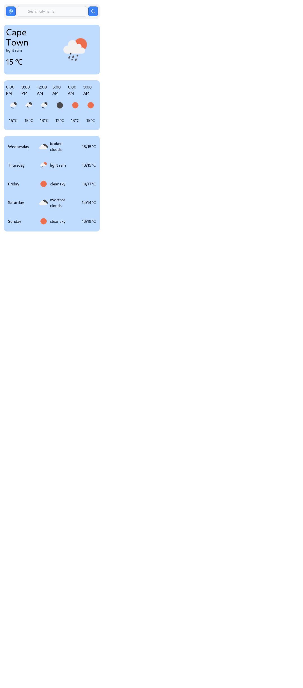
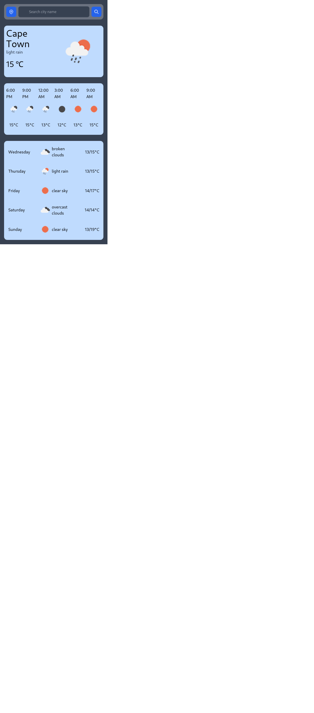
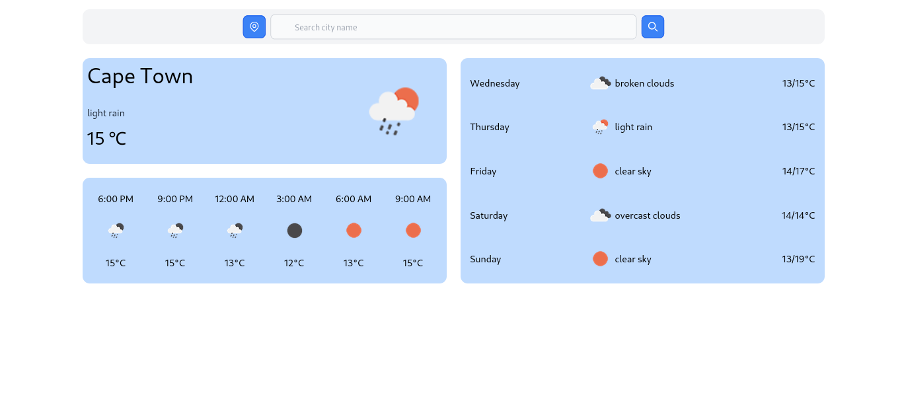

# PHP Weather

This repository contains a basic weather app built using some form of MVC via my custom router that I made available in my repo.

## Features

- Check current weather conditions for a specified city.
- View hourly and weekly weather forecasts.
- Supports searching for weather information by city name or geographic coordinates.
- Error handling for invalid city names or coordinates and connection.

## Getting Started

1. Clone the repository to your local environment:

   ```bash
   git clone https://github.com/chiloanerk/PHPWeather.git
2. Configure your web server to point to the public directory as the document root. I use ```php -S localhost:port -t public```
3. Define your routes in the app/routes/routes.php file.
4. Customize your controllers and views according to your project's requirements.
5. Access your web application in the browser and navigate to the defined routes.

## Usage
- Define routes in the app/routes/routes.php file using the router's methods.
- Create controllers in the app/controllers directory.
- Views are accessed using the custom function ```views('name')```
- Place views in the app/views directory using format ```name.view.php```.

## Screenshots

1. Mobile Dark and Light

- 
- 

2. Desktop Dark and Light

- 
- 